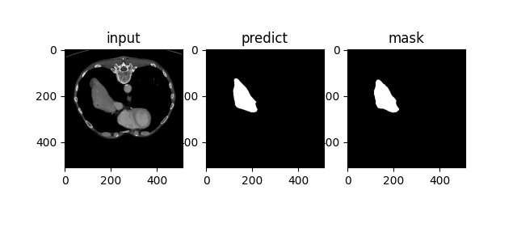

# Medical Image Segmenation and Analysis Based on U-Net

This project is an implementation of medical image segmentation and analysis using U-Net and its variants. It is specifically designed for segmenting and analyzing regions such as the liver and lungs in medical images.

## Features

- Utilizes U-Net architecture and its variants for accurate medical image segmentation.
- Provides segmentation and analysis capabilities for the liver, lungs, and other relevant regions.
- Supports preprocessing and postprocessing techniques to enhance segmentation results.
- Includes evaluation metrics to assess the accuracy and performance of the segmentation model.
- Offers visualization tools for displaying input images, predicted masks, and ground truth masks.

## Requirements

- Python 3.7 or higher
- PyTorch 1.6 or higher
- ***(TODO)*** NumPy, matplotlib, and other dependencies (see `requirements.txt` for full list)

## Getting Started

1. Clone the repository: `git clone ...`
2. Install the required dependencies: `pip install -r requirements.txt`
3. Prepare your dataset or use the provided sample dataset.
***(TODO)***

4. Run the training script to train the segmentation model: `python train.py`
<!-- 
1. Evaluate the model on test images: `python evaluate.py`
2. Customize the code for your specific use case and integrate it into your own projects.
-->
## TODO

- [ ] Test module
- [ ] Requirements
- [ ] Intro
- [ ] Models module
- [ ] Visualization

## Results

    

## License

This project is licensed under the [MIT License](LICENSE).
